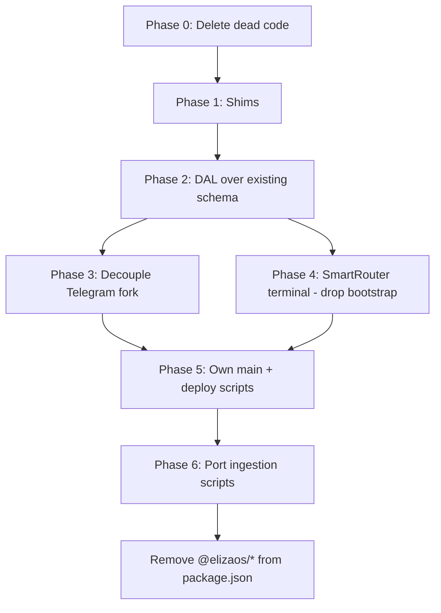

## PEPEDAWN — ElizaOS Decoupling Audit

**Status**: Audit / design proposal (not scheduled)
**Date**: 2026-08-18
**Scope**: What features PEPEDAWN would have to replace if we removed the `@elizaos/*` dependency tree.

---

### 1. Executive Summary

PEPEDAWN is far less coupled to ElizaOS than the dependency list suggests. The highest-value
logic — SmartRouter decisioning, story composition, vision analysis, card lookup, market
monitoring — already runs on direct OpenAI SDK calls and its own data structures. ElizaOS is
doing four jobs that genuinely matter:

1. **Database + schema** (PGLite store, 17 tables, ~32k embedded rows)
2. **RAG / knowledge retrieval** (chunking, embedding, vector search)
3. **Fallback conversation loop** (bootstrap, when SmartRouter declines)
4. **Process host + service registry** (`elizaos start`, `runtime.getService`, lifecycle)

Everything else is either already forked into this repo (Telegram), trivially replaceable
(logger, settings), or dead weight we can delete today.

**Recommended route**: *keep the PGLite schema, drop the framework.* Write a thin DAL over the
tables that already exist, port the ~15 knowledge/memory call sites onto it, make SmartRouter
terminal, and lift the Telegram fork off `@elizaos/core`. This avoids a data migration of
32k embedded rows, which is the only genuinely risky part of the whole exercise.

---

### 2. Coupling Measurements

Taken from the working tree at time of audit.

| Metric | Value |
|---|---|
| Non-test `src/` files importing `@elizaos/core` | 51 (~17,700 LOC) |
| Total `@elizaos/core` import statements (src + packages) | 97 |
| Forked Telegram plugin size | 3,158 LOC (`packages/plugin-telegram-fakerares/src/`) |
| `node_modules` weight | knowledge 57M · server 50M · sql 22M · core 13M · bootstrap 944K |

Most-used core symbols (import counts):

| Symbol | Count | Nature |
|---|---|---|
| `logger` | 58 | Trivial — one-line swap to pino |
| `IAgentRuntime` | 56 | Type-only in most files |
| `Memory` | 28 | Type-only |
| `Service` | 15 | Base class, ~30 LOC to replace |
| `State` / `HandlerCallback` / `Content` / `Action` | 12–10 each | Type-only |
| `ModelType` | 10 | Enum |

Runtime API surface actually exercised:

| Call | Sites | Replacement cost |
|---|---|---|
| `runtime.getService` | 49 | Low — service container |
| `runtime.agentId` | 30 | Low — config value |
| `runtime.getSetting` | 19 | Low — env wrapper |
| `runtime.emitEvent` | 10 | Low — EventEmitter |
| `runtime.useModel` | 8 | Low — 2 real call sites, both dead code |
| `runtime.createMemory` | 7 | **Medium** — DB write path |
| `runtime.searchMemories` | 6 | **Medium** — pgvector query |
| `runtime.ensureConnection` | 6 | **Medium** — entity/room/world sync |
| `runtime.composeState` / `processActions` / `evaluate` | 1 each | Bootstrap-only, all in dead code |

---

### 3. What Would Have to Be Replaced

#### 3.1 Database + schema — the largest single item
**Package**: `@elizaos/plugin-sql` + `@electric-sql/pglite`
**Owns**: `.eliza/.elizadb` — 17 tables, live production data.

| Table | Rows |
|---|---|
| `memories` (type `knowledge`) | 20,009 |
| `memories` (type `documents`) | 11,951 |
| `memories` (type `messages`) | 2,500 |
| `embeddings` | 20,684 |

Also: `agents`, `worlds`, `rooms`, `entities`, `relationships`, `participants`, `channels`,
`central_messages`, `channel_participants`, `components`, `tasks`, `cache`, `logs`,
`message_servers`, `server_agents`.

Replacing means owning the schema, migrations, and pgvector similarity queries. **Or** — the
cheap path — leaving the schema exactly as-is and writing a DAL over it, which reduces this
from "large" to "medium" and eliminates the data-migration risk entirely.

Note: `services/transactionHistory.ts` already opens its **own** PGlite handle independently of
the eliza adapter — proof the pattern works and a useful template for the DAL.

#### 3.2 RAG / knowledge retrieval
**Package**: `@elizaos/plugin-knowledge`
**API used**: `getKnowledge` (8 sites), `addKnowledge` (1), `retrieveKnowledge` (1)
**Consumers**: `utils/loreRetrieval.ts`, `services/KnowledgeOrchestratorService.ts`,
`services/MemoryStorageService.ts`

Provides document chunking, embedding generation, vector search, and result ranking. Rebuild is
roughly 400–600 LOC given the OpenAI SDK is already wired via `utils/modelGateway.ts`.

#### 3.3 Vector search over chat history
**API**: `runtime.searchMemories` (6 sites)
**Consumers**: `providers/userHistoryProvider.ts`, `utils/loreRetrieval.ts`,
`actions/educateNewcomer.ts` (dead)

Same underlying need as 3.2 — a SQL + pgvector helper against `memories` + `embeddings`.

#### 3.4 Fallback conversation loop
**Package**: `@elizaos/plugin-bootstrap`
**Live?** Yes — `.env` has `SUPPRESS_BOOTSTRAP=false`.

When SmartRouter returns no actionable plan, `plugins/fakeRaresPlugin.ts` hands off at
"STEP 6/6: BOOTSTRAP HANDOFF". Bootstrap then composes state from registered providers, selects
actions, generates the reply, and persists response memory.

SmartRouter already handles `FACTS`, `LORE`, `CHAT`, `CARD_RECOMMEND`, `NORESPONSE`, and
`CMDROUTE`. So this is a *generic chat fallback*, not the main path.

**Cheapest replacement**: make SmartRouter's `CHAT` plan terminal (never decline) and delete
bootstrap outright. This also removes the only consumer of the registered providers
(`fakeRaresContextProvider`, `userHistoryProvider`) in their current form — they'd need to be
called directly by the router instead of via `composeState`.

#### 3.5 Model routing / embeddings
**Package**: `@elizaos/plugin-openai` (behind `runtime.useModel`)

Only two real `useModel` call sites — `evaluators/loreDetector.ts` and
`actions/educateNewcomer.ts` — and **both are dead code** (see §5). The genuine dependency is
**embedding generation** for knowledge search and ingestion.

Everything user-facing already bypasses this: `utils/modelGateway.ts` calls the OpenAI SDK
directly with its own telemetry, cost calculation, and reasoning-model handling. `storyComposer`
and `visionAnalyzer` go through it.

The `patchRuntimeForTelemetry()` monkey-patch in `plugins/fakeRaresPlugin.ts` (which wraps
`runtime.useModel` to capture token usage) becomes unnecessary once `useModel` is gone —
telemetry would live natively in the gateway.

#### 3.6 Service registry + lifecycle
**Package**: `@elizaos/core`

`getService` (49), `agentId` (30), `getSetting` (19), `emitEvent` (10), the `Service` base class
(15), `logger` (58). Mechanically shallow: ~200 LOC for a container plus a pino-backed logger
shim covers it. The `logger` import alone accounts for most of the 51-file coupling count and is
a mechanical find-and-replace.

Services currently registered: `KnowledgeOrchestratorService`, `MemoryStorageService`,
`TelemetryService`, `CardDisplayService`, `SmartRouterService`, plus `TransactionHistory`,
`TransactionMonitor`, `TokenScanClient`, `DispenserQueryService`, `PeriodicContentService`.

#### 3.7 Entity / room / world sync + message persistence
**API**: `ensureConnection` (6), `createMemory` (7), `ensureRoomExists` (3), `getWorld`,
`getRoom`, `getEntityById`, `updateEntity`

The Telegram fork writes `messages` memories (`messageManager.ts:996`, `:1348`) which feed
`userHistoryProvider`. We'd own the Telegram-chat → room/entity mapping ourselves.

#### 3.8 Telegram transport — already ours
**Package**: `@elizaos/plugin-telegram` → `file:./packages/plugin-telegram-fakerares`

Already forked into this repo. `telegraf` does the actual protocol work. The fork is coupled to
core's `Service`, `EventType`, `createUniqueUuid`, `ensureConnection`, `registerSendHandler`,
and the `ChannelType`/`Role`/`World`/`Room`/`Entity` types.

**This is a decoupling job, not a rewrite.**

#### 3.9 Process host
**Package**: `@elizaos/cli`

`elizaos start` / `elizaos dev` load the character, resolve the plugin list from
`src/pepedawn.ts`, and manage env. Production chain:
`pm2 (ecosystem.config.cjs) → bun run start → scripts/start-bot.sh → elizaos start`.

We'd write our own `main()`. Small in code terms, but it touches `start-bot.sh`,
`safe-restart.sh`, `kill-bot.sh`, `query-db.js`, `prune-orphan-embeddings.js`, and
`tg-prune-old-telegram.js` — all of which grep for `elizaos start` to detect a running bot.

#### 3.10 Ingestion tooling
`scripts/import-card-visual-facts.ts` and `scripts/tg-import-sessions.ts` boot a programmatic
`ElizaOS` runtime with `plugin-sql` + `plugin-openai` + `plugin-knowledge` to write embedded
knowledge. Both need reimplementation against the new DAL. `scripts/fv-embed-card-facts.ts`
relies on the core OpenAI client for embeddings.

#### 3.11 Dashboard / HTTP API — droppable
**Packages**: `@elizaos/server`, `@elizaos/client`, plus React / Tailwind / Vite

Current usage: a single `/helloworld` route in `src/plugin.ts` and a starter React page in
`src/frontend/`. **Zero real functionality. Delete at no cost.**

---

### 4. Already ElizaOS-Free

Worth stating explicitly — none of this needs replacing:

- `services/SmartRouterService.ts` decision logic (1,153 LOC) — intent classification, plan
  building for FACTS / LORE / CHAT / CARD_RECOMMEND / CMDROUTE
- `utils/modelGateway.ts` — direct OpenAI SDK with telemetry and cost tracking
- `utils/storyComposer.ts`, `utils/visionAnalyzer.ts`
- `services/transactionHistory.ts` — own PGlite instance
- `services/tokenscanClient.ts`, `services/dispenserQuery.ts`, `services/transactionMonitor.ts`
- Card indexes (`data/fullCardIndex.ts`, `fakeCommonsIndex.ts`, `rarePepesIndex.ts`) and
  `utils/cardCache.ts`, `cardIndexRefresher.ts`, `cardUrlUtils.ts`, `fuzzyMatch.ts`
- `utils/embeddingsDb.ts` — CLIP embeddings in flat JSON, no eliza involvement
- `embedding-service/` — standalone Python CLIP microservice on :8001
- `utils/visualEmbeddings.ts` — direct Replicate API
- `utils/telegramMarkdown.ts`, `telegramFileIdCache.ts`, `gifConversionHelper.ts`

---

### 5. Free Wins — Available Today, No Migration Required

These are safe deletions regardless of whether we ever drop ElizaOS:

| Item | Evidence |
|---|---|
| `src/plugin.ts` (starter boilerplate) | Imported by `index.ts` but **not** in `projectAgent.plugins`. Contains fake "Never gonna give you up" model handlers, the `/helloworld` route, and `StarterService`. Never loaded. |
| `evaluators/loreDetector.ts` | Imported at `fakeRaresPlugin.ts:6`, but the plugin declares `evaluators: []`. Never runs. |
| `actions/educateNewcomer.ts` | Exported from `actions/index.ts`, never registered in any plugin's `actions` array. Never runs. |
| `@elizaos/server`, `@elizaos/client`, React/Tailwind/Vite deps, `src/frontend/`, `index.html` | ~50MB of `node_modules` for an unused starter dashboard. |
| `postinstall-fix.sh` | Exists solely to stub the broken `@anthropic-ai/claude-code` package, which only the eliza CLI needs. Dies with the CLI. |

Note that the two dead files (`loreDetector`, `educateNewcomer`) are also the **only two real
`runtime.useModel` call sites** and the only `composeState` / `processActions` consumers.
Deleting them collapses a meaningful slice of §3.5 and §3.4 to zero.

---

### 6. Migration Plan

| Phase | Work | Est. | Risk |
|---|---|---|---|
| 0 | Delete `src/plugin.ts`, dead evaluator/action, server/client/frontend deps | Hours | None |
| 1 | pino logger shim, service container, `Service` base class, settings wrapper | 1–2 days | Low |
| 2 | DAL over the **existing** PGLite schema: knowledge search, memory search, memory write | ~1 week | Medium |
| 3 | Lift `packages/plugin-telegram-fakerares` off `@elizaos/core` | 2–3 days | Medium |
| 4 | Make SmartRouter `CHAT` terminal; call providers directly; delete bootstrap | 2–3 days | Medium |
| 5 | Own `main()`; update `start-bot.sh`, `safe-restart.sh`, `kill-bot.sh`, process-detection greps | 1 day | Low |
| 6 | Port `import-card-visual-facts.ts`, `tg-import-sessions.ts`, `fv-embed-card-facts.ts` | 3–4 days | Medium |

**Sequencing note**: Phase 2 is the keystone — Phases 3, 4, and 6 all depend on it. Phase 0 and 1
can start immediately and independently.

---

### 7. Open Questions

1. **Keep the schema or migrate?** Keeping it avoids re-embedding 32k rows (real OpenAI cost and
   a long backfill window). Migrating buys a schema we actually designed. Recommendation: keep.
2. **Embedding provider** — stay on OpenAI, or move knowledge embeddings onto the local Python
   service that already runs for CLIP? The latter changes vector dimensions and forces a full
   re-embed, so it should be a separate decision from this migration.
3. **Bootstrap fallback quality** — before deleting bootstrap, we should measure how often it
   actually fires in production. The `ALLOW bootstrap` log line in `fakeRaresPlugin.ts` is the
   counter; no production logs were available locally at audit time.
4. **Test suite** — several suites (`character-plugin-ordering.test.ts`, `character.test.ts`,
   `file-structure.test.ts`) assert on the eliza plugin list and would be deleted rather than
   ported.

---

### 8. References

- Entry point: `src/index.ts`
- Character + plugin list: `src/pepedawn.ts`
- Message routing: `src/plugins/fakeRaresPlugin.ts` (MESSAGE_RECEIVED, STEP 1–6)
- Router: `src/services/SmartRouterService.ts`
- Retrieval: `src/utils/loreRetrieval.ts`, `src/services/KnowledgeOrchestratorService.ts`
- Model calls: `src/utils/modelGateway.ts`
- Telegram fork: `packages/plugin-telegram-fakerares/src/`
- Related docs: `PEPEDAWN_SMART_ROUTING_DESIGN.md`, `PEPEDAWN_SCHEMA.md`,
  `../docs/BOOTSTRAP_KNOWLEDGE_FINDINGS.md`
