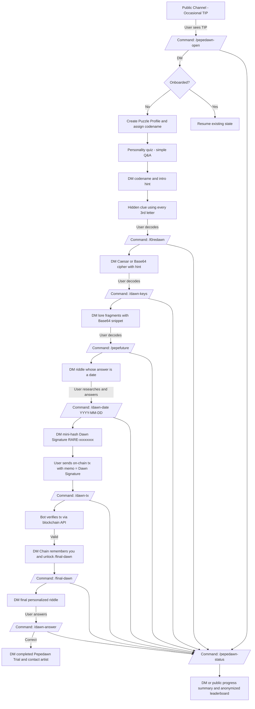

## Pepedawn Multi-Step Puzzle – Full Spec

### 1. Overview & Goals

- **Goal**: Create a multi-day, multi-step puzzle that can only be solved by interacting with the Pepedawn Telegram bot, following clues, and performing lightweight cryptographic / on-chain actions.
- **Experience**:
  - Users occasionally see **TIP** messages in public channels.
  - Curious users follow those tips into **secret slash commands** and **DM-only flows**.
  - They progress through simple puzzles (ciphers, hidden text, lore questions).
  - They eventually **prove identity** with a small on-chain action.
  - Successful users receive a **DM from Pepedawn** indicating they’ve won the PEPEDAWN asset and how to contact the artist.
- **Constraints**:
  - Puzzles must be **fun but not too hard** (solvable with basic tools).
  - All critical interactions are **bot-mediated**.
  - The system supports **per-user progress tracking** and a **leaderboard / progress summary command**.

---

### 2. High-Level Flowchart

The flow below is conceptual; actual implementation can map to a state machine.

---

### 3. Phases & Steps (Detailed)

#### Phase 1 – Discovery & Onboarding

- **Public TIPs**
  - Bot occasionally sends a TIP in selected public channels:
    - Example: “TIP: Some doors only open for those who whisper `/pepedawn-open` at dawn.”
  - TIP messages should look “in-world” and non-spammy.

- **Command: `/pepedawn-open`**
  - **Scope**: Usable in public channels and DMs.
  - **Behavior**:
    - If user has no puzzle profile:
      - Create profile with fields: `user_id`, `tg_username`, `codename`, `state = ONBOARDING`, timestamps.
      - DM user:
        - Brief intro to the Pepedawn Trial.
        - Personality-style question(s) (e.g. choose between 3 dawn types).
        - Assign codename: `DAWN-XYZ` where `XYZ` is a short numeric or alphanumeric ID.
    - If user already has a profile:
      - DM a summary: current phase, next recommended command (and optionally how to use `/pepedawn-status`).

- **Personality Quiz**
  - Simple, 1–3 multiple-choice questions.
  - Answers can slightly branch flavor text, but final state is always:
    - `state = PHASE_1_COMPLETE`  
    - DM contains:
      - Codename (e.g. `DAWN-241`).
      - A hint that there is “hidden text” in messages.

#### Phase 2 – First Cryptic Layer

- **Hidden clue in DM (pattern recognition)**
  - After quiz, send a DM like:
    - “The dawn hides where every third letter tells a story only rare eyes can see.”
    - Another line whose every 3rd character spells `L0REDAWN`.
  - User decodes manually or with a simple script.
  - This suggests a secret command: `/l0redawn`.

- **Command: `/l0redawn`**
  - **Scope**: DM-only recommended (but can technically be valid anywhere with DM reply).
  - **Behavior**:
    - Check that user is at or past PHASE_1_COMPLETE.
    - DM a Caesar or Base64 cipher, e.g.:
      - Encoded text describes `/dawn-keys` as the next command.
    - Include an explicit hint to keep difficulty low:
      - “Dawn is always one step ahead.” ⇒ Caesar shift of 1.

#### Phase 3 – Exploration & Lore

- **Command: `/dawn-keys`**
  - **Scope**: DM.
  - **Behavior**:
    - Send 2–3 short lore fragments.
    - At least one fragment encodes a **Base64 snippet** that decodes to the next command name (e.g. `/pepefuture`).
    - Mark `state = PHASE_2_COMPLETE`.

- **Command: `/pepefuture`**
  - **Scope**: Usable in a public channel but **replies DM-only**.
  - **Behavior**:
    - DM a riddle whose answer is a specific date (`YYYY-MM-DD`).
      - Example: a date from project lore: “the day the rarest frog first woke in 2021”.
    - Instruct user:
      - “When you know the date, use `/dawn-date YYYY-MM-DD`.”

- **Command: `/dawn-date YYYY-MM-DD`**
  - **Scope**: DM.
  - **Behavior**:
    - Validate that the user is at PHASE_2_COMPLETE.
    - Check the submitted date against the correct answer.
    - On success:
      - Set `state = DATE_SOLVED`.
      - Generate and DM the **Dawn Signature** (mini-hash).
    - On failure:
      - Offer a subtle hint and allow retries.

#### Phase 4 – Identity & On-Chain Proof (Bitcoin / Counterparty)

- **Dawn Signature (mini-hash)**
  - **Computation**:
    - Input: `username`, the correct `YYYY-MM-DD` date, maybe `user_id`.
    - Hash function: e.g. `SHA-256(username + ":" + date + ":" + user_id)` and truncate to 8–12 hex chars.
    - Final string: `RARE-<truncated_hash>`, e.g. `RARE-7f9c3b21`.
  - **DM content**:
    - “Your Dawn Signature is: `RARE-7f9c3b21`.  
       This is your proof of awakening. You must engrave this on-chain to proceed.”

- **Wallet Linking (optional but recommended)**
  - **Command: `/dawn-wallet <address>`**
    - Registers the user’s **Bitcoin / Counterparty address** in their profile.
    - Required before accepting on-chain proofs (to map tx sender to TG user).

- **On-Chain Proof (Counterparty on Bitcoin)**
  - **User instructions**:
    - Send a small Counterparty transaction on Bitcoin (e.g. `send` of a tiny amount of XCP or a specific asset) to a specified **Counterparty prize address**.
    - The transaction MUST include the Dawn Signature as the Counterparty **memo / text field** (stored in Bitcoin via `OP_RETURN` according to the Counterparty protocol).
  - **Verification approaches**:
    1. **Direct scan (background job)**:
       - Periodically query a **Counterparty indexer / API** (e.g. `counterparty-server`, `xchain.io`, etc.) for Counterparty transactions:
         - Destination (recipient) address == configured prize address.
         - Parsed Counterparty memo/text == stored Dawn Signature for a user.
       - Use `source` (sender) address + `dawn_signature` to map to the user profile.
    2. **User-submitted TX hash (simpler)**:
       - Provide command: `/dawn-tx <tx_hash>`.
       - Bot queries the Counterparty API for that single Bitcoin transaction and validates:
         - Counterparty decoded recipient address matches the prize address.
         - Counterparty memo/text matches stored Dawn Signature.
         - (Optional) Counterparty `source` address matches linked wallet (if using `/dawn-wallet`).

- **Command: `/dawn-tx <tx_hash>`**
  - **Scope**: DM.
  - **Behavior**:
    - Check user has a Dawn Signature issued and is in `DATE_SOLVED` state.
    - Fetch tx details from the Counterparty protocol (via indexer / API).
    - Validate:
      - Recipient = configured prize address.
      - Memo/comment = user’s stored Dawn Signature.
      - (Optional) Sender = user’s linked wallet.
    - On success:
      - Set `state = ONCHAIN_VERIFIED`.
      - DM: “The chain remembers you. One last dawn remains. Use `/final-dawn` when you’re ready.”

#### Phase 5 – Finale & Completion

- **Command: `/final-dawn`**
  - **Scope**: DM.
  - **Behavior**:
    - Check `state = ONCHAIN_VERIFIED`.
    - Generate a short **personalized riddle** using:
      - Their codename (`DAWN-###`).
      - Their quiz answers (e.g. “Silent” vs “Loud” dawn).
      - Some static lore (e.g. sky color, first dawn location).
    - Prompt user to answer via `/dawn-answer <answer>`.

- **Command: `/dawn-answer <answer>`**
  - **Scope**: DM.
  - **Behavior**:
    - Validate answer against the correct solution(s) for their path.
    - On success:
      - Set `state = COMPLETED`.
      - Add the user to a **winners list** (for the leaderboard and admin review).
      - DM: clear win message, including:
        - That they completed the Pepedawn Trial.
        - Instructions to contact the artist (e.g. TG handle, email, etc.).

---

### 4. Progress Tracking & Leaderboard Command

#### State Model

Each user has a puzzle profile with fields such as:

- `user_id` (Telegram)
- `tg_username`
- `codename` (e.g. `DAWN-241`)
- `wallet_address` (optional)
- `state` (enum), suggested values:
  - `NEW` (no progress yet)
  - `ONBOARDING`
  - `PHASE_1_COMPLETE` (quiz done, hidden clue DM sent)
  - `PHASE_2_COMPLETE` (cipher and lore steps done)
  - `DATE_SOLVED` (correct `dawn-date` submitted, Dawn Signature issued)
  - `ONCHAIN_VERIFIED` (tx validated)
  - `COMPLETED` (final riddle solved)
- `created_at`, `updated_at`
- `finished_at` (only when `COMPLETED`)
- `dawn_signature`
- Misc. booleans or counters (e.g. hints used, retries).

#### Command: `/pepedawn-status`

- **Purpose**:
  - Provide **per-user progress** and a **gamified leaderboard snapshot**.
  - Users can see how many participants are in the puzzle and how far along others are (anonymously).

- **Scope**:
  - Can be invoked in public channels or DM.
  - Responses should **always be DM-only** to avoid clutter and leaks of personal progress details.

- **Per-User Progress Output** (in DM):
  - Example:
    - “Pepedawn Status for `@username` (`DAWN-241`):  
       - Current Phase: `PHASE_2_COMPLETE` (Lore fragments solved)  
       - Next Action: Use `/pepefuture` to discover the date riddle.  
       - Hints used: 1.”
  - Display a **simple phase label** to avoid spoilers:
    - e.g. `Phase 1 · The First Dawn`, `Phase 2 · Keys of Lore`, etc.

- **Leaderboard / Global Progress Output**:
  - Same `/pepedawn-status` DM can include aggregated stats such as:
    - Total participants.
    - Count of users per phase (without names):
      - “Seekers by phase:  
         - Onboarded: 37  
         - Keys of Lore: 22  
         - On-chain Verified: 5  
         - Completed: 2”
    - (Optional) A **top N fastest finishers** list by codename only:
      - “Fastest Completed (top 5): DAWN-013, DAWN-021, DAWN-087, DAWN-144, DAWN-241”
  - No TG usernames or wallet addresses in public leaderboard chunks to preserve privacy and mystery.

- **Data Sourcing**:
  - Query profiles table/collection:
    - `total_participants = count(*)`
    - `completed_count = count(state = COMPLETED)`
    - `phase_counts = grouped count by state`
    - `top_completed = first N by finished_at ascending`

#### Optional Command: `/pepedawn-top`

- If desired, separate leaderboard into its own command:
  - `/pepedawn-status` → personal progress.
  - `/pepedawn-top` → anonymized leaderboard + stats.
- Implementation is similar; both rely on the same profile data.

---

### 5. TIP Logic & Hint System

- **TIP Posting**
  - Configure Pepedawn to occasionally post TIPs in selected channels:
    - Either on a pseudo-random schedule or triggered by message volume/activity.
  - TIP examples:
    - “TIP: Some keys only appear to those who type `/pepedawn-open` before the sun scrolls away.”
    - “TIP: When the text looks broken64, perhaps it wants to be whole again.”
  - TIPs should:
    - Hint at secret commands without fully revealing them.
    - Occasionally reference concepts from the current live phase (e.g. base64, dates, signatures).

- **Hint Command: `/dawn-help`**
  - **Scope**: DM.
  - **Behavior**:
    - Contextual hints based on user’s current `state`.
      - If stuck at PHASE_1: explain how to look for every 3rd letter.
      - If stuck at PHASE_2: explain what Base64 looks like and that online decoders exist.
      - If stuck at date riddle: nudge them toward specific lore commands or pinned posts.
    - Optionally track hints used (to show in `/pepedawn-status`).

---

### 6. Difficulty & UX Considerations

- **Cryptography is simple by design**:
  - Caesar cipher with explicit shift hints.
  - Very short Base64 strings with obvious textual context.
  - Acrostics or “every Nth character” clues that are clearly hinted.

- **Friction Management**:
  - Avoid multi-hour “research” steps; each step should be solvable in minutes.
  - The **multi-day feel** comes from:
    - Users naturally taking breaks.
    - Optional time-gating (e.g. some commands only available N hours after previous state).

- **Error Handling**:
  - All commands should handle “out-of-sequence” use gracefully:
    - If user runs `/dawn-tx` before having a Dawn Signature, explain what they’re missing and link them back to the right command.
    - If they repeat completed steps, give them a friendly recap.

---

### 7. Implementation Notes (Bot Side)

- **State Storage**:
  - Use existing user profile / session storage to track puzzle state, codename, etc.
  - Ensure idempotence:
    - Re-running commands shouldn’t duplicate records or break progress.

- **Commands Summary**
  - **Discovery & Onboarding**:
    - `/pepedawn-open` – Join or resume the puzzle.
  - **Puzzle Progression**:
    - `/l0redawn` – Access first cipher.
    - `/dawn-keys` – Receive lore fragments and Base64 clue.
    - `/pepefuture` – Get date riddle (DM only).
    - `/dawn-date YYYY-MM-DD` – Submit date solution and receive Dawn Signature.
  - **On-Chain & Identity**:
    - `/dawn-wallet <address>` – Link wallet (optional but recommended).
    - `/dawn-tx <tx_hash>` – Submit proof transaction for verification.
  - **Finale**:
    - `/final-dawn` – Receive final riddle.
    - `/dawn-answer <answer>` – Submit final solution and complete the trial.
  - **Support & Gamification**:
    - `/dawn-help` – Contextual hints based on current phase.
    - `/pepedawn-status` – Personal progress + anonymized leaderboard/stats.
    - (Optional) `/pepedawn-top` – Dedicated leaderboard view.

- **Blockchain Integration (Bitcoin / Counterparty)**:
  - Target chain: **Bitcoin**, using the **Counterparty protocol** to embed and read Dawn Signatures via `OP_RETURN`.
  - Use either:
    - A self-hosted `counterparty-server` (and Bitcoin full node) exposing JSON-RPC, or
    - A hosted Counterparty indexer / API (e.g. xchain-style service).
  - Implement a small service or helper that:
    - Fetches and decodes Counterparty messages for a given tx hash.
    - Verifies destination (prize address), source (user’s address), and memo/text (Dawn Signature).
    - (Optionally) runs a background scan for new qualifying Counterparty txs to auto-advance users without requiring `/dawn-tx`.

---

### 8. Win Condition & Admin View

- **User Win Experience**:
  - On completing `/dawn-answer` successfully:
    - DM:
      - “You have completed the Pepedawn Trial. You are now a bearer of the PEPEDAWN asset.  
         Contact the artist at [artist handle] to claim your prize.”
  - Optionally, small cosmetic DM (animated GIF, ASCII art, or a rare quote).

- **Admin / Artist Support**:
  - Maintain an internal list of winners with:
    - `user_id`, `tg_username`, `codename`, `wallet_address`, `finished_at`.
  - Optional admin command (not exposed to users), e.g. `/dawn-admin winners`, for easy export of winners.

This spec should be sufficient to implement Pepedawn’s multi-step puzzle, including user-friendly puzzles, verifiable on-chain proof, and a gamified leaderboard-style `/pepedawn-status` command.

